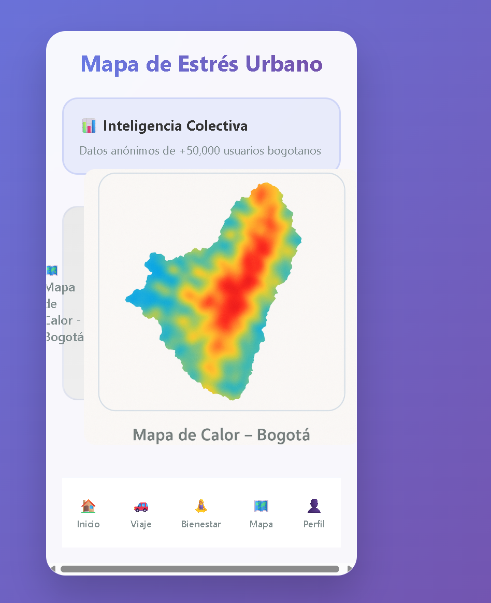

# 🌆 Bogotá Tranquila - Asistente para el Bienestar Urbano

**Bogotá Tranquila** es una aplicación móvil experimental enfocada en mejorar el bienestar emocional de los ciudadanos durante sus desplazamientos urbanos, especialmente en contextos de alto tráfico y estrés.

## 🚀 Funcionalidades

- 👤 Login de Usuario
- 📊 Dashboard de Bienestar
- 🚗 Modo Viaje Seguro
- 🎵 Recursos de Bienestar
- 🗺️ Mapa de Estrés Urbano
- 🆘 Botón SOS
- 👩‍💼 Perfil de Usuario

## 🧰 Tecnologías

- HTML5 + CSS3 + JavaScript Vanilla
- Diseño responsivo y moderno

## 📦 Estructura del Proyecto

```
bogota-tranquila/
├── index.html
├── style.css
├── script.js
├── mapa.png
└── README.md
```

## 📸 Captura de Pantalla



## ✨ Estado del Proyecto

🚧 MVP funcional. Futuras mejoras pueden incluir integración con mapas reales, sensores biométricos y autenticación.

## 🙌 Autor

**Luis Ernesto Vergara Robledo**  
*Ingeniero en Informática | Explorador de ideas útiles y humanas*
